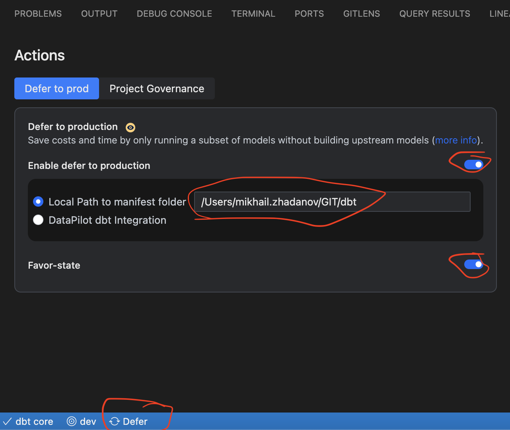

# Local dbt Install

⚠️ **Please note:** This method isn't officially supported by dbt. If you opt for it, you're on your own.

By following these steps, you will be able to use dbt within **Visual Studio Code** (VS Code for short), *i.e.*, locally on your computer (rather than in the cloud). Using VS Code for dbt development provides several advantages over the dbt Cloud client:

* Faster development cycles: With local access to files, you can make, save, and test changes more quickly without the lag of cloud sync.
* Advanced integrations: Leverage extensions like GitHub Copilot for AI-powered code suggestions, which can accelerate model development and enhance code quality.
* Customizable environment: Configure VS Code with plugins, settings, and themes that suit your workflow, helping you optimize productivity.
* Enhanced debugging and testing: VS Code supports comprehensive debugging tools and command-line access, allowing for faster troubleshooting and seamless integration with local databases or environments."


## Installation guide

> ⚠️ The following guide was prepared for MacOS users. For Windows users, it is suggested to use WSL with Ubuntu >=20 and begin from step #2.


1. Install VS Code from the Software Center.

2. Inside VS Code, go to the **Extensions** panel and add the following:
   - Power User for dbt
   - Sqlfluff
   - vscode-dbt

3. Clone the [new-work/dbt repository](https://github.com/new-work/dbt) in a dedicated local directory and open it in VS Code.

    NEW: Automated install script for MacOS users. Run the following command in your terminal:

    ```bash
    ./docs/files/dbt-local-install.sh
    ```
    Next steps are for manual installation and can mostly be skipped. BUT you still need to update the `profiles.yml` and `.env` files with your personal details.

4. Using the VS Code terminal, set up a python virtual environment inside the cloned repository (dbt folder), and install the necessary packages. Follow one by one these commands:

    ```bash
    # create a python virtual environment using venv
    python3 -m venv dbt-env

    # activate the environment
    source dbt-env/bin/activate

    # install/upgrate pip:
    python -m pip install --upgrade pip

    # install necesary python libraries:
    pip install --upgrade pip wheel setuptools dbt-core dbt-snowflake sqlfluff-templater-dbt

    # pull dbt dependencies:
    dbt deps
    ```

5. Also, inside the dbt folder, create the configuration file `.vscode/settings.json` with the following arguments:

   ```json
   {
      "files.associations": {
         "*.sql": "jinja-sql",
         "*.md": "markdown",
         "*.yaml": "jinja-yaml",
         "*.yml": "jinja-yaml"
      },
      "python.defaultInterpreterPath": "${workspaceFolder}/dbt-env/bin/python",
      "sqlfluff.config": "${workspaceFolder}/.sqlfluff",
      "sqlfluff.executablePath": "${workspaceFolder}/dbt-env/bin/sqlfluff",
      "sqlfluff.linter.run": "onSave",
      "sqlfluff.experimental.format.executeInTerminal": true,
      "sqlfluff.format.enabled": true,
      "editor.formatOnSave": false,
      "dbt.queryLimit": 500,
      "dbt.dbtPythonPathOverride": "${workspaceFolder}/dbt-env/bin/python"
   }
   ```

   Notice that you can always create folders and files using the VS Code Explorer view.

6. (Optional) In order to automatically update dbt every time you launch vscode, create the file `.vscode/tasks.json` with the following arguments:

   ```json
   {
   "version": "2.0.0",
   "tasks": [
       {
           "label": "Update dbt and Dependencies",
           "type": "shell",
           "command": "${workspaceFolder}/dbt-env/bin/pip install --upgrade pip wheel setuptools dbt-core dbt-snowflake sqlfluff-templater-dbt",
           "runOptions": {
               "runOn": "folderOpen"
           },
           "problemMatcher": [],
           "presentation": {
               "echo": true,
               "reveal": "always",
               "focus": false,
               "panel": "shared",
               "showReuseMessage": true,
               "clear": false,
               "close": true
           }
       },
       {
           "label": "Update Manifest",
           "type": "shell",
           "command": "${workspaceFolder}/dbt-env/bin/python ${workspaceFolder}/update_manifest.py",
           "runOptions": {
               "runOn": "folderOpen"
           },
           "problemMatcher": [],
           "presentation": {
               "echo": true,
               "reveal": "always",
               "focus": false,
               "panel": "shared",
               "showReuseMessage": true,
               "clear": false,
               "close": true
           }
       }
   ]
   }
   ```

   This will automatically update your dbt installation every time you open the project in vscode. Notice however that dbt's loading time will slightly increase.

7. In your computer's home directory (not the dbt folder), generate the dbt profiles file `~/.dbt/profiles.yml` with the following arguments — don't forget to update the `user`, `role`, `warehouse` and `schema` fields with your personal details:

   ```yaml
   default:
     target: dev
     outputs:
       dev:
         type: snowflake
         account: nwse-dwh
         user: NAME.SURNAME@NEW-WORK.SE❗
         role: YOUR_BU_ROLE❗
         authenticator: externalbrowser
         database: analytics
         warehouse: YOUR_BU_WAREHOUSE_NAME❗
         schema: TEST_NAME_SURNAME❗
         threads: 4
         client_session_keep_alive: False
         connect_retries: 0
         connect_timeout: 10
         retry_on_database_errors: False
         retry_all: False
         reuse_connections: False
   ```

   > **Note:** You will have to manually navigate to your home directory, using Finder or the terminal, and manually create the file.
   >
   > Once created, you can also create a quick access to this file within the dbt folder (*i.e.*, VS Code) by typing in the VS Code terminal the following command:

   ```bash
   ln -s ~/.dbt/profiles.yml profiles.yml
   ```

8. On the repository's main directory, you will find the `dbt-env/bin/activate` file. At the bottom of this file, append the following lines:

   ```bash
   export DBT_DEFER="true"
   export DBT_STATE="<YOUR_FULL_PATH_TO_DBT_FOLDER>/"❗
   ```
   To find your local path to the dbt folder, you can run `pwd` in the VS Code terminal to get something like: `/Users/name.surname/GitHub/dbt`.<br>
   Notice that `DBT_STATE` should have the value with the full path to your dbt folder. In order to find it, you can run `pwd` in the VS Code terminal to get something like: `/Users/name.surname/GitHub/dbt`.<br>


9. We don't store file `manifest.json` in the repository anymore because it has very negative impact on dbt Cloud performance due to its size. <br>
   Instead we have a script `update_manifest.py` that lets you download the manifest file from dbt Cloud. <br>
   To make it work you'll need to copy `.env.example` to `.env` and fill in the `DBT_CLOUD_API_TOKEN` field with your dbt Cloud API token. <br>
   
   ```bash
    cp .env.example .env
    ```
    Generate your token in dbt Cloud by going to [Settings->API tokens->Personal tokens](https://emea.dbt.com/settings/accounts/74/pages/personal-tokens)
    And update the `DBT_CLOUD_API_TOKEN` field in the `.env` file with your token.

    Then run the script to download the manifest file:
    ```bash    
    ./update_manifest.py
    ```

10. Restart VS Code.

11.  In VS Code's bottom blue panel, click on **Defer**. There, turn on both `Enable defer to production` and `Favor-state`. Finally, select the `Local Path to manifest folder` that points to the same path as in step 8 (`/Users/name.username/GitHub/dbt/`).<br>
     It should look like the following:

      

12. We are finally ready to test VS Code: let's open any lightweight model and click on *Execute dbt SQL* on the tool bar at the top right (the play ▶️ button). You should get the output of the model within the **QUERY RESULTS** tab in the Toggle Panel.


## VS Code Usage Tips

- Use standard dbt commands within the vscode terminal.
- Activate the python virtual environment each time you start vscode with `source dbt-env/bin/activate`.
- Always ensure you're on the right branch before making modifications.
- Utilize the quick buttons at the top of the window to promptly run or compile your model when it's open.
- Note: `sqlfluff` can be glitchy and might show errors. Disregard these and use the shortcut CMD+SHIFT+P (or CTRL+SHIFT+P on Windows) followed by "format document" to format.
- Formatting via `sqlfluff` isn't instantaneous; be patient.

## Update Packages

To keep your installation current, use the following commands:

```bash
source dbt-env/bin/activate
pip install --upgrade pip wheel setuptools dbt-snowflake sqlfluff-templater-dbt
```

## Troubleshooting

In case of error `ModuleNotFoundError: No module named 'dbt.adapters.factory'`:
```bash
pip uninstall dbt-adapters -y && pip install dbt-adapters
```