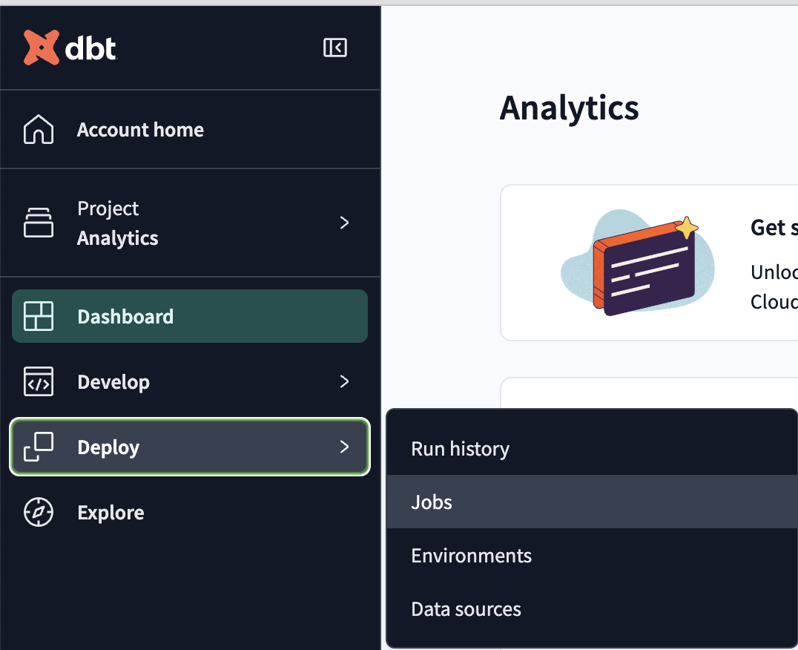
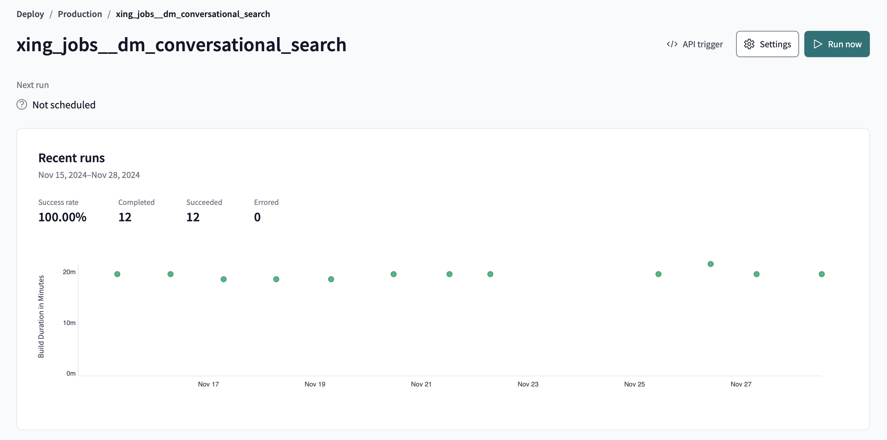
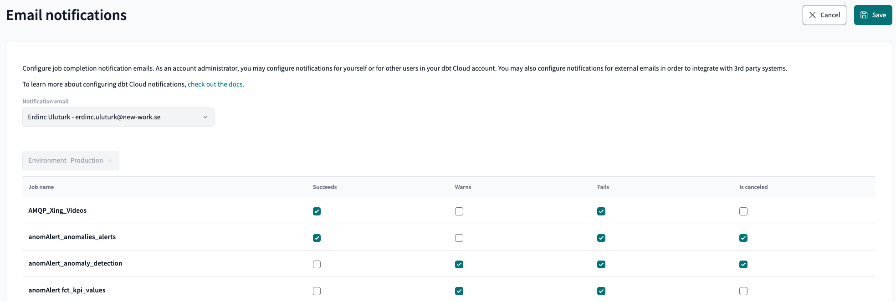

# Building and Orchestrating models

- [Building and Orchestrating models](#building-and-orchestrating-models)
  - [Building a model](#building-a-model)
    - [Special usage](#special-usage)
    - [To have in mind](#to-have-in-mind)
  - [Merging Changes into Production: Pull Request Process](#merging-changes-into-production-pull-request-process)
  - [Deploying a model to production](#deploying-a-model-to-production)
  - [Orchestrating with Airflow](#orchestrating-with-airflow)
    - [Trigerring a dbt job: `DbtCloudRunJobOperator`](#trigerring-a-dbt-job-dbtcloudrunjoboperator)
    - [Orchestrating several DAGs: `TriggerDagRunOperator`](#orchestrating-several-dags-triggerdagrunoperator)
  - [Handling Warnings and Error Notifications](#handling-warnings-and-error-notifications)


## Building a model

The **`dbt build`** command is a powerful, all-in-one command that automates the process of building models, running tests, and executing snapshots and seeds in a dbt project. It simplifies the development workflow by combining the functionality of several other dbt commands, including `dbt run`, `dbt test`, `dbt snapshot`, and `dbt seed`. This makes it particularly useful for both development and deployment workflows, as it ensures that your entire dbt project is executed in the correct order.

When you run `dbt build`, it:

1. **Builds your models**: Materializes models based on their configurations (e.g., tables, views, incremental models).
2. **Executes tests**: Runs both generic and custom tests to ensure data quality.
3. **Seeds data**: Loads CSV files into your data warehouse using `dbt seed`.
4. **Executes snapshots**: Captures data snapshots (if defined) to track changes over time.

This comprehensive approach ensures that all aspects of your dbt project are handled in one command.


### Special usage

The `dbt build` command can be executed for the entire project, a single model, or multiple models using selectors. When multiple models are selected, they are executed in a directed acyclic graph (DAG) order, based on the dependencies defined by the `ref()` function.

1. **Basic Model Selection**

   You can select individual models to build:

   ```bash
   dbt build --select central_dm_abilify_credit_usages
   ```

   This command will build the model `central_dm_abilify_credit_usages` and run tests associated with it.

2. **Building Multiple Models**

   To build several models at once, specify multiple models in the `--select` flag:

   ```bash
   dbt build --select central_dm_abilify_credit_usages central_dm_abilify_transactions
   ```

   This builds both the `central_dm_abilify_credit_usages` and `central_dm_abilify_transactions` models.

3. **Using Folder Paths to Select Models**

   You can specify model paths to select all models within a folder:

   ```bash
   dbt build --select models/central/billed_seats
   ```

   This will build all models located at `models/central/billed_seats`.

4. **Building Models Using Dot Syntax**

   Another option is to use dot syntax to specify models in particular schemas:

   ```bash
   dbt build --select central.braze
   ```

   This will build all `braze` models under the `central`.

5. **Selecting Models with Wildcards and Exclusions**

   You can select models with wildcards and exclude specific models:

   ```bash
   dbt build --select central.activity.* --exclude central_dm_xing_nwt_event_monitoring
   ```

   This builds all models under `central.activity` but excludes the `central_dm_xing_nwt_event_monitoring` model.

6. **Tag-Based Model Selection**

   You can also use tags to select models, excluding any models marked as "legacy":

   ```bash
   dbt build --select models/central/contracts/01_contracts --exclude tag:legacy
   ```

   This will build all models located at `models/central/contracts/01_contracts` while excluding all models tagged as "legacy."

   > For more information about tags, refer to the [dbt documentation on tags](https://docs.getdbt.com/reference/resource-configs/tags).

7. **Building All Upstream Models**

   To build all upstream dependencies of a model, use the `+` symbol before the model name:

   ```bash
   dbt build --select +central_dim_calendar
   ```

   This builds the `central_dim_calendar` model and all its upstream dependencies.

8. **Building Only Direct Upstream Dependencies**

   You can limit the selection to direct upstream dependencies by specifying a number before the `+`:

   ```bash
   dbt build --select 1+central_dim_calendar
   ```

   This builds the `central_dim_calendar` model and only its immediate upstream dependency.

9. **Building Multiple Levels of Upstream Dependencies**

   You can select multiple levels of upstream models by increasing the number before the `+`:

   ```bash
   dbt build --select 2+central_dim_calendar
   ```

   This builds the `central_dim_calendar` model and the two levels of upstream dependencies.

10. **Building All Downstream Models**

   To build downstream dependencies (models that depend on the target model), use the `+` after the model name:

   ```bash
   dbt build --select central_dim_calendar+
   ```

   This will build the `central_dim_calendar` model and all models that depend on it.

11. **Building Direct Downstream Dependencies**

   You can also limit the downstream selection to a certain number of levels:

   ```bash
   dbt build --select central_dim_calendar+1
   ```

   This will build the `central_dim_calendar` model and only its direct downstream dependencies.

12. **Combining Upstream and Downstream Models**

   You can combine upstream and downstream selections by placing `+` before and after the model:

   ```bash
   dbt build --select +central_dim_calendar+
   ```

   This will build the `central_dim_calendar` model, all its upstream dependencies, and all downstream dependents.

13. **Selecting Multiple Levels Upstream and Downstream**

   You can specify how many levels to include for both upstream and downstream dependencies:

   ```bash
   dbt build --select 1+central_dim_calendar+3
   ```

   This will build one level of upstream dependencies and three levels of downstream dependencies for the `central_dim_calendar` model.

### To have in mind

When using dbt build, it’s important to be precise in model selection to avoid unnecessary executions. Utilize the `--select` and `--exclude` flags to target specific models and reduce build time, especially in large projects.

Use the `+` selector with caution. While it is useful for including upstream and downstream models, overuse or misapplication can lead to executing more models than intended, causing performance issues or unintended side effects. Always verify the scope of the models being built when using the + selector to avoid undesirable executions.


## Merging Changes into Production: Pull Request Process

Before merging any changes into the production environment, it's important to follow a clear pull request (PR) process to ensure code quality and prevent issues in production.

1. **Write a Clear Pull Request Message**:
   - The PR message should provide a concise summary of the changes being made. Include details such as:
     - The purpose of the changes (e.g., new model, bug fix, or performance improvement).
     - Any key models or datasets affected.
     - Associated tickets or references for context (if applicable).
   - Example PR message:
     ```
     Add new central_dm_abilify_credit_usages model
     - Implements credit usage tracking for the Abilify dataset.
     - Affects central_dm_abilify_transactions model.
     - Linked to ticket #1234 for further context.
     ```

2. **Request Peer Review**:
   - Always have a colleague review your changes before merging into the `main` branch.
   - The reviewer should validate the code logic, ensure the changes adhere to dbt best practices, and check for potential impact on existing models and data quality.
   - Peer reviews are essential for catching issues early, providing an additional layer of quality assurance.

By following this process, you ensure that changes to production are well-documented, peer-reviewed, and less prone to introducing errors or inconsistencies in the data pipeline.


## Deploying a model to production

After building your model, it is time to materialise the data in production. This can be achieved via DBT Job deployment. 
Please note that the model build orchestration is intelligently processed by DBT based on the model lineage. 

Please find below a step-by-step guide to create dbt jobs for production deployment: 

- Open DBT Cloud IDE
- Navigate to 'Deploy' and select 'Jobs' 

- select "Create Job" and then "Deploy Job" 

In the 'Deploy Job' page, it is possible to define jobs details. 

Jobs settings:
   - **Job Name**: the job name should follow naming convention (businessUnit_businessObject_modelName --> [central_activity__all_models](https://emea.dbt.com/deploy/74/projects/309/jobs/32594))x.
   -  **Environment**: this the target environment. For production deployment, "prdocution" should be seleted.

Execution Settings: 
   - here the dbt command for the job should be manually entered. For more info about dbt commands, please refer to the related [documentation](#building-a-model)
   - by clicking on '+ Add command' it is possible to add multiple dbt commands to be executed within the same job. 

Triggers: 
   - **please note that jobs in dbt should be triggered and orchestrated via Airflow.**

By clicking on 'Save' the dbt job will be created. The job id can be found in the API Trigger section (more info in [Orchestrating with Airflow](#Orchestrating-with-Airflow)) or simply in the last url component (https://emea.dbt.com/deploy/74/projects/309/jobs/**238615**). 


## Orchestrating with Airflow

dbt Cloud offers a built-in job scheduler for automating dbt runs. This allows teams to execute their transformations regularly, ensuring their data models are always up-to-date. However, dbt Cloud's built-in scheduler often falls short when dealing with complex workflows that go beyond simple sequential job execution. Its primary limitation lies in its narrow scope: it is designed specifically to schedule dbt runs without accommodating broader pipeline orchestration needs. This can become a significant bottleneck for teams managing interconnected data pipelines or workflows requiring intricate dependencies, timing, and integrations with external systems.

For instance, consider a scenario where:
- **Dependencies span multiple domains**: One dbt job (e.g., processing marketing data) must complete before another (e.g., processing sales data) can start.
- **Non-linear execution is needed**: Multiple dbt jobs must run in parallel, followed by a job that combines their outputs.
- **External systems are involved**: You need to trigger dbt jobs based on upstream data availability or incorporate downstream steps like analytics model deployment or notification systems.
- **Custom scheduling requirements exist**: Complex schedules, such as event-driven triggers or varying execution times, are difficult to configure using the dbt Cloud scheduler.

In these cases, the dbt scheduler's simplicity becomes a limitation. While it handles straightforward use cases well, it cannot manage workflows with non-trivial lineage or dependencies that cross tool boundaries. This is where **Airflow**, becomes essential. Airflow allows teams to design, monitor, and manage sophisticated data workflows, making it an ideal companion to dbt for orchestrating complex pipelines.

An review of Airflow's basic usage is beyond the scope of this documentation. However, team members can refer to our [Analytics internal documentation](https://new-work.atlassian.net/wiki/spaces/XINGCentral/pages/134677680/7.3+Airflow+XING+Analytics) for a comprehensive overview. 

In this section, we will focus specifically on triggering dbt jobs within Airflow DAGs and subsequently orchestrating multiple DAGs into a cohesive, end-to-end workflow.


### Trigerring a dbt job: `DbtCloudRunJobOperator`

Let's take a datamart as example! The *Conversational Search* dbt job builds several dbt models, all for this specific domain. These models then update tables connected to a monitoring Tableau dashboard.

Let’s use a practical example to illustrate this! Consider the *Conversational Search* dbt job, which builds several models within a specific domain. These models populate tables that feed into a monitoring Tableau dashboard.



To integrate this dbt job into an Airflow DAG, you’ll need its unique identifier. This Job ID can be found by clicking the `</> API trigger` button at the top right of the dbt job page. For instance, in our example, the Job ID is `185036`. Alternatively, it can be retrieved from the URL of the dbt job page (e.g., `https://emea.dbt.com/deploy/74/projects/309/jobs/185036`).

This identifier will be crucial when setting up the Airflow DAG. Below is an example of an Airflow DAG orchestrating two dbt jobs, our example above and a second one with similar properties:

```python
# data marts
from airflow import DAG
from airflow.providers.dbt.cloud.operators.dbt import DbtCloudRunJobOperator
from datetime import timedelta
import pendulum

# ++++++++++++++++++++++++++++++++++++++++++++++++++++++++++++++++++++++	DAG setup

default_args = {
	'owner': 'xing_jobs',
	'depends_on_past': False,
	'start_date': pendulum.datetime(2024, 7, 15, 0, 0, tz='Europe/Berlin'),
	'email': ['hector.ramirez@xing.com'],
	'email_on_failure': True,
	'email_on_retry': False,
	'retries': 3,
	'retry_delay': timedelta(minutes=60),
	'max_active_runs': 1,
	'dbt_cloud_conn_id': 'bi_dbt',
	'account_id': 74
}

dag = DAG(
	dag_id='xing_jobs__dm_conversational_search',
	default_args=default_args,
	schedule_interval='0 9 * * 1',
	catchup=False,
	tags=['xing_jobs', 'snowflake', 'hector']
)

# ++++++++++++++++++++++++++++++++++++++++++++++++++++++++++++++++++++++	Tasks

# https://emea.dbt.com/deploy/74/projects/309/jobs/185036
trigger__dm_conversational_search = DbtCloudRunJobOperator(
    task_id='trigger__dm_conversational_search',
    job_id=185036,
    dag=dag
)

# https://emea.dbt.com/deploy/74/projects/309/jobs/232938
trigger__dm_conversational_search_default = DbtCloudRunJobOperator(
    task_id='trigger__dm_conversational_search_default',
    job_id=232938,
    dag=dag
)

# ++++++++++++++++++++++++++++++++++++++++++++++++++++++++++++++++++++++	DAG

trigger__dm_conversational_search_default >> trigger__dm_conversational_search
```

In the DAG configuration, pay attention to the dbt connection details: `dbt_cloud_conn_id` and `account_id`. These parameters are predefined by the BI team and should be used consistently across all Airflow DAGs you create.

Next, you’ll see tasks that trigger dbt jobs. These tasks use the `DbtCloudRunJobOperator`, where the key parameter to specify is the `Job ID` obtained earlier from the dbt console. This ensures the correct dbt job is executed within the DAG.

Finally, the `>>` operator defines the dependencies between tasks, indicating to Airflow that one dbt job must complete before the next job begins. In other scenarios, datamarts may not have direct dependencies and can instead be triggered to run in parallel.

> A [template DAG](https://source.xing.com/data-platform/airflow-dags/blob/main/bi/python/bi_utils_shared/bi_dbt_cloud_job_run_dag_template/BI_DBT_CLOUD_JOB_RUN_DAG_TEMPLATE.py) has been created by the BI team to showcase the full configuration of the `DbtCloudRunJobOperator`, including various parameters and setup options.


### Orchestrating several DAGs: `TriggerDagRunOperator`

In the example above, we combined two dbt jobs within a single Airflow DAG. This DAG is scheduled to run on Mondays at 9 AM, where Task 1 is triggered first, followed by Task 2. Although the models built by these jobs belong to two separate dbt jobs, they share a higher-level purpose within a unified domain—such as **data marts**. In such cases, it makes sense to group them into a single DAG.

However, data marts should only be updated after the intermediate or fact models they depend on are refreshed. Since these represent distinct domains, they should be managed in separate Airflow DAGs. It is then logical to let the upstream DAG to trigger the data marts DAG automatically upon completion.

This is achieved by adding a new task within the dependency DAG:

```python
xing_jobs__dm_conversational_search = TriggerDagRunOperator(
    task_id="xing_jobs_fct_models_dag_trigger",
    trigger_dag_id="xing_jobs__dm_conversational_search",
    dag=dag,
    provide_context=True,
    execution_date="{{execution_date}}",
    wait_for_completion=False
)
```

Let's unpack the parameters here:
- `trigger_dag_id`: This specifies the ID of the DAG to be triggered. In this example, it refers to the data marts DAG.
- `provide_context`: Passed additional set of keyword arguments.
- `execution_date="{{execution_date}}"`: This passes the execution date of the current DAG run to the triggered DAG. This is useful for maintaining consistency across related runs, especially when debugging or aligning timestamps for downstream tasks.
- `wait_for_completion`: Specifies whether the triggering DAG should wait for the triggered DAG to complete. If set to True, the current DAG will pause at this task until the triggered DAG finishes, which could be useful for tightly coupled workflows. If set to False (as in this example), the triggering DAG marks this task as successful immediately after initiating the triggered DAG, allowing the workflow to proceed without waiting.

**Important**: Once the orchestration between DAGs is set up, you should remove any fixed schedule from the triggered DAG. In the example above, instead of keeping the hardcoded schedule for Mondays at 9 AM, we will set the `schedule_interval=None`. This ensures that the triggered DAG runs only when explicitly called by the dependency DAG, rather than on a fixed schedule.

By leveraging Airflow, you can build robust, scalable, and maintainable data pipelines that align with your team's needs. This orchestration approach ensures accurate, timely, and efficient data processing.


## Handling Warnings and Error Notifications

When running dbt models in production, it's critical to monitor for warnings or errors to ensure the reliability and accuracy of your data pipeline. These issues might arise due to a variety of reasons, such as data quality issues, failing tests, or upstream failures.

Both dbt and Airflow provide built-in mechanisms to help identify and troubleshoot these problems:

- **Notifications via Airflow**:  
   When using Airflow to schedule dbt jobs, the `DbtCloudRunJobOperator` integrates seamlessly with Airflow’s alerting mechanisms. If the operator task fails, Airflow can be configured to send email notifications to alert the relevant stakeholders. This adds another layer of monitoring and ensures prompt attention to issues.

- **Accessing Logs in dbt Cloud**:  
   If a dbt job fails or raises warnings, detailed logs are accessible within the job’s run metadata in the dbt Cloud interface. These logs include information about the failing model(s), error messages, and execution details, making it easier to debug issues quickly.

- **Configuring Email Notifications in dbt Cloud**
    dbt Cloud also provides native email notification capabilities, enabling users to receive automated alerts based on job statuses. This feature is particularly useful for teams that want to stay informed without relying solely on external orchestration tools.

    Users can configure notifications for the following events:
    - **Success**: Receive a notification when a job completes successfully. Useful for confirming important updates.
    - **Failure**: Be notified immediately if a job fails, allowing for rapid response and debugging.
    - **Warnings**: Get alerts for non-critical issues that might require attention later.
    - **Cancellations**: Stay informed if a job is manually or programmatically stopped.

    Each user can customize their notification preferences in the **Notification Settings** tab of dbt Cloud:
    1. Navigate to the **Notification Settings** page. [Here's a sample link](https://emea.dbt.com/settings/notifications/74/projects/309/email).
    2. Toggle the settings to enable email alerts for the desired events (success, failure, warning, or cancellation).
    3. Save the configuration.

    

    Once configured, dbt will send alerts directly to your email, keeping you informed about job outcomes without requiring you to check logs proactively. Alternatively, alerts to MS Teams groups can be configured by the BI team.
