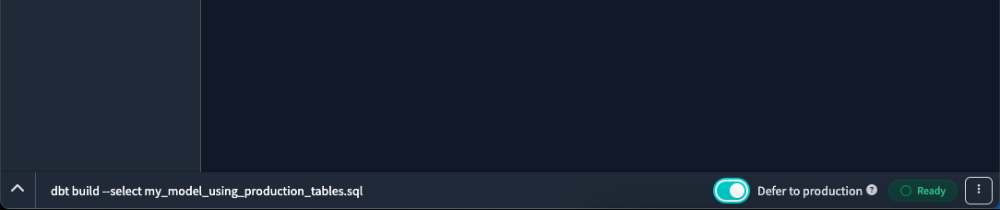

# How to Use Production Tables in Your Development Environment

When building dbt models on top of existing production models, dbt might not access the tables since it looks within your development schema. Here's how you can address this challenge:

1. **Utilizing the `defer` Functionality in dbt**

   The official recommendation from dbt is to use the `defer` functionality. When you provide the `defer` argument to the dbt command, dbt checks for information regarding existing production tables and integrates them into the compiled SQL code.

   Be aware that `defer` functionality integrates a production table to the compiled SQL only if that particular table doesn't exist within the development schema. In other words; if an input table already exists in development schema, the SQL code will be compiled using that version even if `defer` functionality is used.

    **How to enable `defer`:**

   i. Starting from **dbt version 1.6**, `defer` functionality can be easily enabled using the **"Defer to production"** toggle at the right end of command line on **dbt Cloud IDE**.

    

   ii. On the other hand, old method of manually providing `defer` argument to dbt command together with `state` argument and relevant state name is still working and using production tables from [prod-state/manifest.json](../prod-state/manifest.json)

   **Example:**
   ```shell
   dbt build --select central_dim_mobile_devices --defer --state prod-state
   ```

   Be aware that [prod-state/manifest.json](../prod-state/manifest.json) is regenerated whenever a PR merges into the `main` branch via the [GitHub on-merge Action](../.github/workflows/.dbt-prod-state.yml).

   [Learn more about this method here.](https://docs.getdbt.com/reference/node-selection/defer)

2. **Manual Table Cloning in Snowflake**

   Within Snowflake, you can manually clone production schemas into your development schema using SQL commands.

   **To clone a single table:**
   ```sql
   create or replace transient table analytics.test_mikhail_zhadanov.dim_cities clone analytics.central.dim_cities;
   ```

   **To clone multiple tables:**
   ```sql
   USE DATABASE ANALYTICS;

   EXECUTE IMMEDIATE $$
   DECLARE 
       source_schema STRING DEFAULT 'CENTRAL';
       target_schema STRING DEFAULT 'TEST_MIKHAIL_ZHADANOV';
       table_filter STRING DEFAULT 'DIM_%';    
       query_string STRING;
       cloned_tables_count INTEGER DEFAULT 0;
       cur CURSOR FOR SELECT TABLE_NAME FROM INFORMATION_SCHEMA.TABLES WHERE TABLE_SCHEMA = ? AND TABLE_NAME ILIKE ?;
   BEGIN
       OPEN cur USING(source_schema, table_filter);
       FOR rec IN cur DO
           query_string := 'CREATE OR REPLACE TRANSIENT TABLE ' || target_schema || '.' || rec.TABLE_NAME || ' CLONE ' || source_schema || '.' || rec.TABLE_NAME;
           EXECUTE IMMEDIATE query_string;
           cloned_tables_count := cloned_tables_count + 1;
       END FOR;
       RETURN cloned_tables_count || ' tables were cloned successfully.';
   END;
   $$;
   ```

3. **Using Visual Studio Code (Unofficial Solution)**

   If you're employing Visual Studio Code, the `defer` functionality can be automated by configuring environment variables. For detailed instructions, refer to section 8 of the [installation guide](dbt-local-install.md#installation).